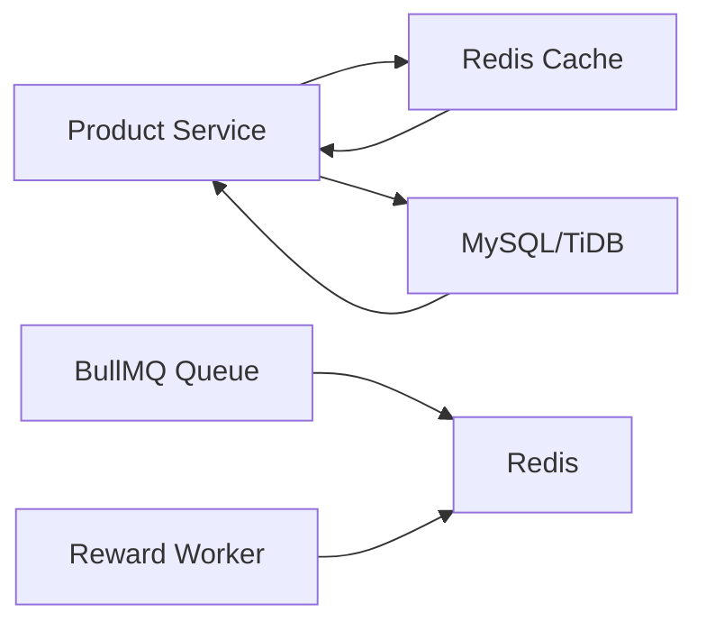
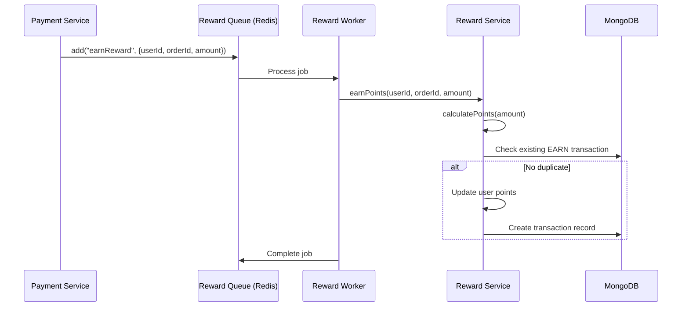
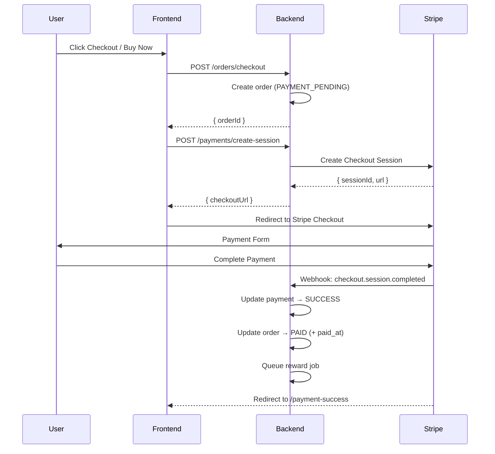
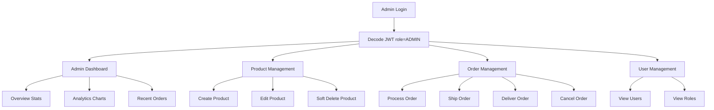

# Architecture

## Overview

The Rewarding Platform follows a **layered architecture** with a clear separation of concerns across frontend and backend. The backend implements the **Repository Pattern** and **Service Layer** pattern to maintain clean boundaries between data access and business logic.

```
┌─────────────────────────────────────────────────────┐
│                   Frontend (React)                   │
│  ┌──────────┐  ┌──────────┐  ┌──────────────────┐  │
│  │  Pages   │  │ Layouts  │  │   Components     │  │
│  └────┬─────┘  └──────────┘  └──────────────────┘  │
│       │                                              │
│  ┌────▼─────┐  ┌──────────┐  ┌──────────────────┐  │
│  │  Routes  │──│  Store   │  │   API (Axios)    │  │
│  └──────────┘  └──────────┘  └────────┬─────────┘  │
└────────────────────────────────────────┼────────────┘
                                         │ HTTP/JSON
┌────────────────────────────────────────┼────────────┐
│              Backend (Express)         │            │
│  ┌─────────────────────────────────────▼──────────┐ │
│  │           Middleware (Auth, Role, Error)        │ │
│  └───────────────────────┬─────────────────────────┘ │
│                          │                            │
│  ┌───────────────────────▼─────────────────────────┐ │
│  │              Controller Layer                    │ │
│  │    Handles HTTP requests/responses               │ │
│  └───────────────────────┬─────────────────────────┘ │
│                          │                            │
│  ┌───────────────────────▼─────────────────────────┐ │
│  │               Service Layer                      │ │
│  │    Business logic, validation, orchestration      │ │
│  └────┬──────────────────────┬─────────────────────┘ │
│       │                      │                        │
│  ┌────▼──────────┐   ┌──────▼──────────────────────┐ │
│  │  Repository   │   │  External Services           │ │
│  │  (Data Access)│   │  Stripe, Redis, BullMQ       │ │
│  └────┬──────────┘   └─────────────────────────────┘ │
│       │                                                │
│  ┌────▼────────────────────────────────────────────┐  │
│  │  Databases                                        │  │
│  │  MySQL (TiDB) ── Users, Products, Orders, Cart   │  │
│  │  MongoDB ────── Reward Transactions               │  │
│  └───────────────────────────────────────────────────┘  │
└─────────────────────────────────────────────────────────┘
```

## Frontend Architecture

### Page Flow
```
BrowserRouter
├── Public Routes
│   ├── / ................... Login
│   ├── /register ........... Register
│   ├── /payment-success .... Payment Success
│   ├── /payment-cancel ..... Payment Cancel
│   └── /logout ............. Logout
│
├── Protected Routes (AppLayout wrapper)
│   ├── /products ........... Products (Customer)
│   ├── /cart ............... Cart
│   ├── /orders ............. Orders List
│   ├── /orders/:id ......... Order Details
│   ├── /rewards ............ Rewards
│   └── /profile ............ Customer Dashboard
│
└── Admin Routes (AdminLayout wrapper)
    ├── /admin .............. Dashboard
    ├── /admin/products ..... Product Management
    ├── /admin/orders ....... Order Management
    └── /admin/users ........ User Management
```

### State Management
- **Zustand** store for authentication state (`auth.store.js`)
- Token persisted in `localStorage`
- JWT decoded client-side for role-based UI rendering
- Component-local state for page-specific data

### Data Flow
1. Pages fetch data via Axios API layer
2. Axios interceptor attaches JWT Bearer token
3. 401 responses trigger automatic logout + redirect
4. Components use `useToast` hook for user feedback
5. Modals handle confirmation flows

## Backend Architecture

### Request Lifecycle
```
HTTP Request
    │
    ▼
app.js (Express)
    │
    ├── helmet (security headers)
    ├── cors (cross-origin)
    ├── compression (gzip)
    ├── morgan (logging)
    │
    ▼
Routes ──► Middleware ──► Controller ──► Service ──► Repository ──► Database
    │
    ▼
Error Middleware
    │
    ▼
HTTP Response
```

### Middleware Flow
```
Request
  │
  ▼
authMiddleware ──► JWT verification, sets req.user
  │
  ▼
roleMiddleware ──► Checks user role (ADMIN)
  │
  ▼
Controller
```

### Repository Pattern
Each data entity has a dedicated repository class that encapsulates SQL queries:

```
repository/
├── user.repository.js
├── product.repository.js
├── cart.repository.js
├── order.repository.js
├── payment.repository.js
├── reward.repository.js
└── admin.repository.js
```

Repositories accept optional `connection` parameter for MySQL transactions, enabling atomic multi-table operations.

### Service Layer
Services contain business logic and orchestrate multiple repositories:

```
service/
├── auth.service.js      ── Registration, login, password hashing
├── product.service.js   ── CRUD with Redis caching
├── cart.service.js      ── Cart management with stock validation
├── order.service.js     ── Checkout, status management, expiry, cancellation
├── payment.service.js   ── Stripe sessions, webhooks, retry
├── reward.service.js    ── Points calculation, earning, redemption
└── admin.service.js     ── Dashboard aggregation, analytics
```

### Controller Layer
Controllers are thin — they parse request data, delegate to services, and format responses. All follow the pattern:

```javascript
async method(req, res, next) {
    try {
        const result = await service.method(req.user.id, req.body);
        return res.status(200).json({ success: true, data: result });
    } catch (error) {
        next(error);
    }
}
```

## Redis Integration



- **Product Caching:** `GET /api/products` results cached by page with 5-minute TTL
- **Cache Invalidation:** On product create/update/delete, all `products:*` keys are deleted
- **BullMQ:** Redis serves as the job queue backend for asynchronous reward point calculation

### BullMQ Flow



## Stripe Flow



### Zero-Amount Orders
When the full order amount is covered by reward points:
1. Order is created with `finalAmount = 0`
2. Payment session is skipped
3. Order is marked `PAID` immediately
4. Reward job is queued with `amount = 0`

## Reward Flow

```mermaid
graph TD
    A[User Spends ₹X] --> B[calculatePoints: floor(X/10)]
    B --> C{Points > 0?}
    C -->|Yes| D[Check existing EARN for orderId]
    D --> E{Already earned?}
    E -->|Yes| F[Skip - Idempotency]
    E -->|No| G[Update users.reward_points]
    G --> H[Create MongoDB transaction]
    H --> I[User redeems in cart]
    I --> J[Validate balance]
    J --> K[Deduct points]
    K --> L[Apply discount to order]
    L --> M[Create REDEEM transaction]
    M --> N[Order cancellation]
    N --> O[Refund points]
    O --> P[Create REFUND transaction]
```

## Admin Flow



## Database Architecture

### Hybrid Database Design
```
MySQL (TiDB)                    MongoDB
─────────────                   ────────
Transactional Data              Ledger/Event Data
─────────────────               ────────────────
users                           rewardtransactions
products                              ├── userId (ref users.id)
orders                                ├── orderId (ref orders.id)
order_items                           ├── points
payments                              ├── type (EARN/REDEEM)
carts                                 ├── description
cart_items                            └── timestamps
coupons (planned)
```

- **MySQL** stores core transactional data with ACID compliance
- **MongoDB** stores reward points as an append-only event log
- `users.reward_points` is a denormalized cache — the MongoDB transaction log is the source of truth
- Cross-database references are logical (no foreign keys)

## Error Handling

All errors are caught in controllers and forwarded to a centralized error middleware:

```javascript
// error.middleware.js
(err, req, res, next) => {
    return res.status(400).json({
        success: false,
        message: err.message,
    });
};
```

Error messages are user-friendly and returned consistently across all endpoints.
